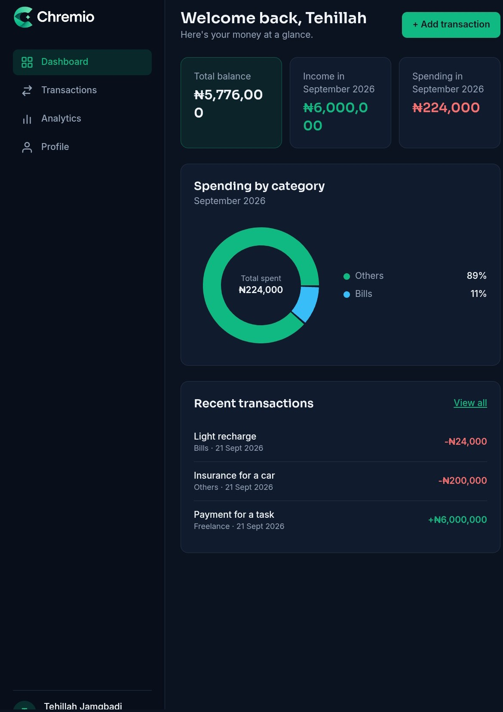
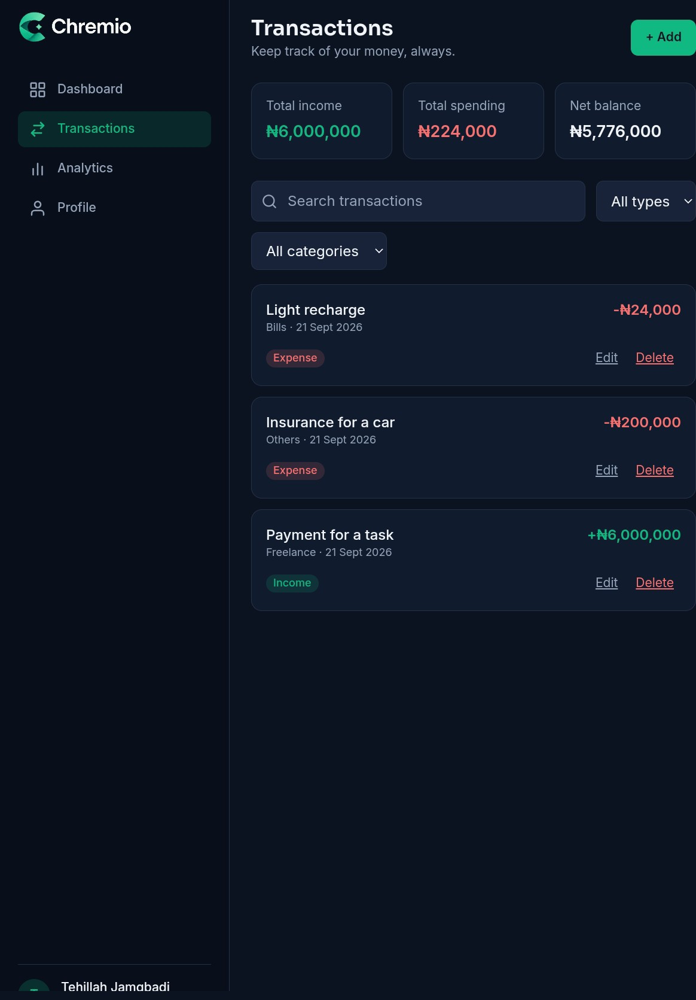
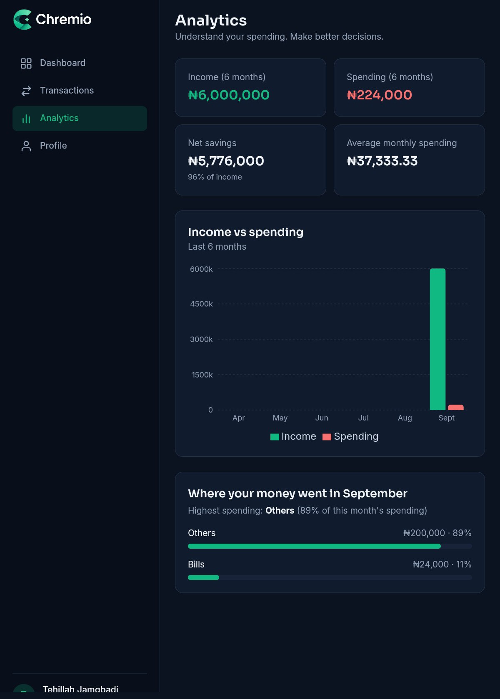
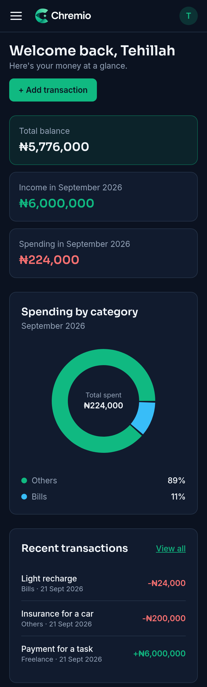

# Chremio

> Manage your money. Build your future.

Chremio is a full-stack personal finance tracker. Users create an account, record income and spending, and see where their money goes through a dashboard and charts.

Built as **Task 3 (Expense Tracker Web Application)** of the Full Stack Development Internship at **Auspify Technologies**.

- **Live demo:** https://chremio.vercel.app/
- **Repository:** https://github.com/uknicTjstyles/Chremio

## Screenshots

| Dashboard | Transactions |
|---|---|
| 



 | 

 

  |

  | Analytics | Mobile menu |
  |---|---|
  | 

  

   | 

   

    |

    ## Features

    **Accounts and security**
    - Sign up and sign in with email and password
    - Passwords are hashed with bcrypt; sessions use signed, httpOnly cookies
    - Changing your password signs you out on every device
    - Profile page to update your name, change your password, or delete your account (which also removes your transactions)

    **Transactions**
    - Add, edit and delete income and expense records
    - Categories, descriptions and dates
    - Search and filter by type or category
    - Totals for income, spending and net balance

    **Dashboard and reports**
    - Total balance, plus income and spending for the current month
    - Spending-by-category donut chart
    - Recent transactions
    - Analytics page: 6-month income vs spending chart, savings rate, average monthly spending, and a category breakdown

    **Experience**
    - Dark theme with a consistent brand identity
    - Fully responsive: sidebar on desktop, hamburger menu on phones
    - Toast notifications for every success and error
    - Page-loading progress bar and spinner
    - Icons on all inputs, with show/hide on password fields

    ## Task requirements

    | Requirement (Task 3) | How it is met |
    |---|---|
    | Design dashboard screens | Dashboard, Transactions, Analytics and Profile pages |
    | Create expense management APIs | REST API routes for transactions, summary and profile |
    | Store financial records in a database | MongoDB Atlas via Mongoose |
    | Display reports and summaries | Dashboard cards and charts, plus the Analytics page |
    | Implement authentication | Email and password auth with session cookies |

    ## Tech stack

    | Area | Technology |
    |---|---|
    | Framework | Next.js (App Router) with React and TypeScript |
    | Styling | Tailwind CSS |
    | Database | MongoDB Atlas with Mongoose |
    | Authentication | jose (signed JWT cookies) and bcryptjs |
    | Charts | Recharts |
    | Notifications | react-toastify |
    | Hosting | Vercel |

    ## Getting started

    ### Prerequisites
    - Node.js 20.9 or newer
    - A free [MongoDB Atlas](https://www.mongodb.com/atlas) cluster

    ### Setup

    ```bash
    git clone https://github.com/uknicTjstyles/Chremio.git
    cd chremio
    npm install
    ```

    Create a `.env.local` file in the project root (see `.env.example`):

    ```
    MONGODB_URI=mongodb+srv://<user>:<password>@<cluster>.mongodb.net/chremio?retryWrites=true&w=majority
    AUTH_SECRET=<a long random string>
    ```

    Generate a secret with:

    ```bash
    openssl rand -base64 32
    ```

    Start the development server:

    ```bash
    npm run dev
    ```

    Open http://localhost:3000.

    To check a production build:

    ```bash
    npm run build
    npm start
    ```

    ### Environment variables

    | Variable | Description |
    |---|---|
    | `MONGODB_URI` | MongoDB Atlas connection string, including the database name (`/chremio`) |
    | `AUTH_SECRET` | Secret used to sign session cookies. Keep it private. |

    ## Project structure

    ```
    app/
    ├─ (auth)/            sign-in and sign-up pages
    ├─ (app)/             signed-in pages with the sidebar shell
    │  ├─ dashboard/
    │  ├─ transactions/
    │  ├─ analytics/
    │  └─ profile/
    ├─ api/               REST API routes
    ├─ layout.tsx         root layout, toasts, loading bar
    └─ page.tsx           landing page
    components/           UI components (forms, charts, shell)
    lib/                  database connection, session, helpers
    models/               Mongoose models (User, Transaction)
    
    ```

    ## API reference

    All routes except register and login require a signed-in session.

    | Method | Route | Description |
    |---|---|---|
    | POST | `/api/auth/register` | Create an account |
    | POST | `/api/auth/login` | Sign in |
    | POST | `/api/auth/logout` | Sign out |
    | GET | `/api/transactions` | List transactions (`q`, `type`, `category` filters) |
    | POST | `/api/transactions` | Add a transaction |
    | PUT | `/api/transactions/:id` | Update a transaction |
    | DELETE | `/api/transactions/:id` | Delete a transaction |
    | GET | `/api/summary` | Balance, monthly totals, category and monthly chart data |
    | PATCH | `/api/profile` | Update name |
    | PUT | `/api/profile/password` | Change password (signs out all devices) |
    | DELETE | `/api/profile` | Delete account and all its transactions |

    ## Security notes

    - Passwords are hashed with bcrypt and never stored in plain text.
    - Session cookies are httpOnly, so page scripts cannot read them.
    - Every transaction query is scoped to the signed-in user's ID, so users can only see and change their own data.
    - Each session carries a version number tied to the account. Changing the password invalidates all older sessions, and deleting the account invalidates them too.
    - Secrets live in environment variables and are never committed.

    ## Deployment

    The app is deployed on Vercel:

    1. Import the GitHub repository on Vercel.
    2. Add `MONGODB_URI` and `AUTH_SECRET` as environment variables.
    3. In MongoDB Atlas, allow network access from `0.0.0.0/0` so Vercel can connect.
    4. Deploy. Every push to `main` redeploys automatically.

    ## Possible improvements

    - Monthly budgets with progress tracking
    - Savings goals
    - CSV export of transactions
    - Recurring transactions

    ## Author

    **Tehillah Eneye Jamgbadi**
    Full Stack Development Intern, Auspify Technologies