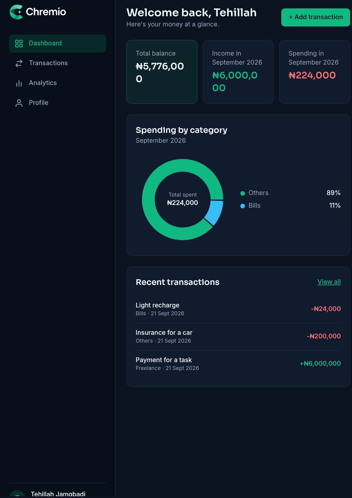
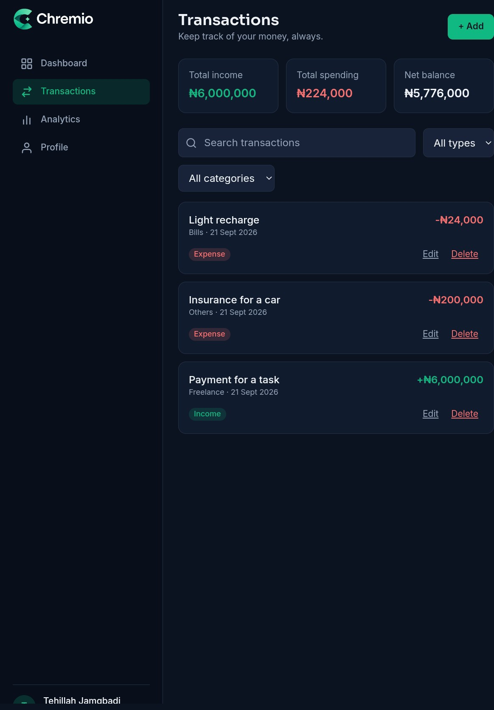
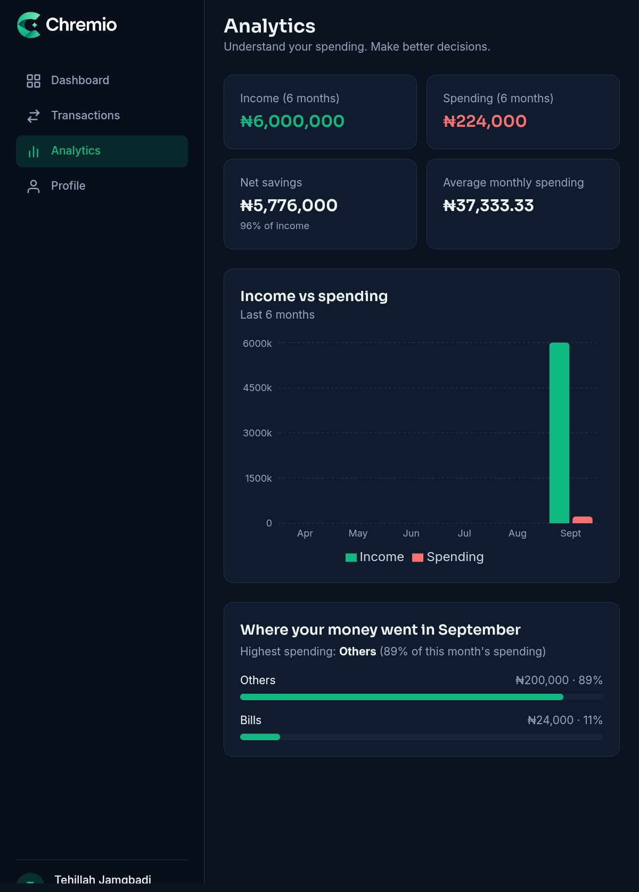
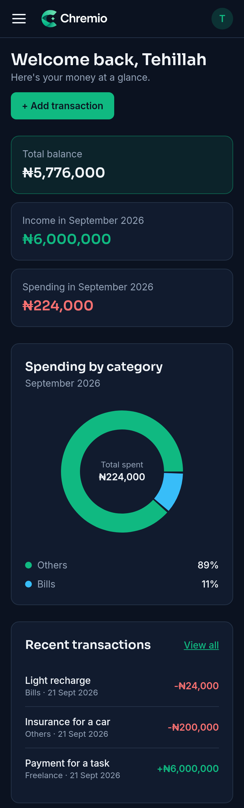

CHREMIO

Manage your money. Build your future.

Chremio is a full-stack personal finance tracker designed to help users manage their income, expenses, and overall financial activity from one place.

Users can create an account, record income and expenses, monitor their balance, and understand their spending habits through interactive dashboards and analytics.

Built as Task 3 — Expense Tracker Web Application for the Full Stack Development Internship at Auspify Technologies.

<p align="center">
  <a href="https://chremio.vercel.app/">
    <strong>🚀 View Live Demo</strong>
  </a>
  &nbsp;&nbsp;•&nbsp;&nbsp;
  <a href="https://github.com/uknicTjstyles/Chremio">
    <strong>💻 View Repository</strong>
  </a>
</p>---

📸 Screenshots

Dashboard

<p align="center">
  
</p>Transactions

<p align="center">
  
</p>Analytics

<p align="center">
  
</p>Mobile Menu

<p align="center">
  
</p>---

✨ Features

🔐 Accounts & Security

- Sign up and sign in with email and password
- Passwords securely hashed with "bcrypt"
- Signed "httpOnly" session cookies
- Password changes automatically invalidate existing sessions
- Profile management
- Update account name
- Change password
- Delete account and associated transactions

💰 Transaction Management

- Add income and expense records
- Edit existing transactions
- Delete transactions
- Transaction categories
- Descriptions and dates
- Search transactions
- Filter by transaction type
- Filter by category
- View total income
- View total spending
- View current net balance

📊 Dashboard & Analytics

- Current total balance
- Monthly income
- Monthly spending
- Recent transactions
- Spending-by-category donut chart
- Six-month income vs. spending chart
- Savings rate
- Average monthly spending
- Category breakdown
- Dedicated analytics dashboard

🎨 User Experience

- Modern dark-themed interface
- Consistent Chremio brand identity
- Fully responsive design
- Desktop sidebar navigation
- Mobile hamburger menu
- Toast notifications for success and error states
- Page-loading progress bar
- Loading spinners
- Input icons
- Show/hide password functionality

---

📋 Task Requirements

Requirement| Implementation
Design dashboard screens| Dashboard, Transactions, Analytics and Profile pages
Create expense management APIs| REST API routes for transactions, summary and profile
Store financial records in a database| MongoDB Atlas with Mongoose
Display reports and summaries| Dashboard cards, charts and Analytics page
Implement authentication| Email/password authentication with session cookies

---

🛠️ Tech Stack

Area| Technology
Framework| Next.js (App Router)
Frontend| React
Language| TypeScript
Styling| Tailwind CSS
Database| MongoDB Atlas
ODM| Mongoose
Authentication| "jose" + signed JWT cookies
Password Hashing| "bcryptjs"
Charts| Recharts
Notifications| React Toastify
Deployment| Vercel

---

🚀 Getting Started

Prerequisites

Before running Chremio locally, make sure you have:

- Node.js 20.9 or newer
- A MongoDB Atlas account and cluster
- Git

1. Clone the Repository

git clone https://github.com/uknicTjstyles/Chremio.git
cd Chremio

2. Install Dependencies

npm install

3. Configure Environment Variables

Create a ".env.local" file in the root of the project:

MONGODB_URI=mongodb+srv://<user>:<password>@<cluster>.mongodb.net/chremio?retryWrites=true&w=majority
AUTH_SECRET=<your-long-random-secret>

You can use ".env.example" as a reference if it is included in the repository.

4. Generate an Authentication Secret

You can generate a secure secret using:

openssl rand -base64 32

Copy the generated value into "AUTH_SECRET".

5. Start the Development Server

npm run dev

Then open:

http://localhost:3000

6. Test the Production Build

npm run build
npm start

---

🔑 Environment Variables

Variable| Description
"MONGODB_URI"| MongoDB Atlas connection string, including the "chremio" database
"AUTH_SECRET"| Secret used to sign and validate user sessions

⚠️ Never commit ".env.local" or expose your authentication secrets publicly.
---

**📁 Project Structure**

```text
Chremio/
├── app/
│   ├── (auth)/
│   ├── (app)/
│   ├── api/
│   ├── layout.tsx
│   └── page.tsx
├── components/
├── lib/
├── models/
├── public/
├── docs/
├── package.json
└── README.md


🔌 API Documentation

Chremio uses REST API routes to handle authentication, transactions, financial summaries, and user profile management.

Authentication

Method| Endpoint| Description
"POST"| "/api/auth/register"| Create a new user account
"POST"| "/api/auth/login"| Authenticate a user
"POST"| "/api/auth/logout"| End the current session

Transactions

Method| Endpoint| Description
"GET"| "/api/transactions"| Retrieve the user's transactions
"POST"| "/api/transactions"| Create a new transaction
"PUT"| "/api/transactions/:id"| Update an existing transaction
"DELETE"| "/api/transactions/:id"| Delete a transaction

The transactions endpoint supports filtering and searching:

/api/transactions?q=food
/api/transactions?type=expense
/api/transactions?category=Food

Financial Summary

Method| Endpoint| Description
"GET"| "/api/summary"| Retrieve balance, income, spending, category and monthly analytics data

Profile

Method| Endpoint| Description
"PATCH"| "/api/profile"| Update the user's name
"PUT"| "/api/profile/password"| Change the user's password
"DELETE"| "/api/profile"| Delete the user's account and transactions

🔒 Authentication: Protected endpoints require an active authenticated session. Users can only access and modify their own financial records.


---

🛡️ Security

Chremio implements several security measures to protect user accounts and financial data:

- Passwords are hashed using "bcrypt"
- Passwords are never stored in plain text
- Authentication cookies use the "httpOnly" flag
- Transactions are scoped to the authenticated user's account
- Users cannot access another user's transactions
- Session versions are tied to user accounts
- Changing a password invalidates older sessions
- Deleting an account also invalidates its sessions
- Sensitive configuration values are stored in environment variables
- Secrets are excluded from version control

---

🚀 Deployment

Chremio is deployed on Vercel.

To deploy your own instance:

1. Fork or clone the repository.
2. Import the project into Vercel.
3. Add the required environment variables.
4. Configure your MongoDB Atlas connection.
5. Deploy the application.

Required Environment Variables

MONGODB_URI=your_mongodb_connection_string
AUTH_SECRET=your_secret_key

Once connected to GitHub, new commits pushed to the configured production branch can be automatically deployed by Vercel.

---

🔮 Future Improvements

Some planned improvements include:

- [ ] Monthly budgets with progress tracking
- [ ] Savings goals
- [ ] CSV transaction export
- [ ] Recurring transactions
- [ ] More detailed financial reports
- [ ] Improved financial insights
- [ ] Additional chart visualizations

---

👨‍💻 Author

Tehillah Eneye Jamgbadi

Computer Engineering
Full Stack Development Intern — Auspify Technologies

---

<p align="center">
  Built with ❤️ using Next.js, TypeScript, MongoDB and Tailwind CSS.
</p>
